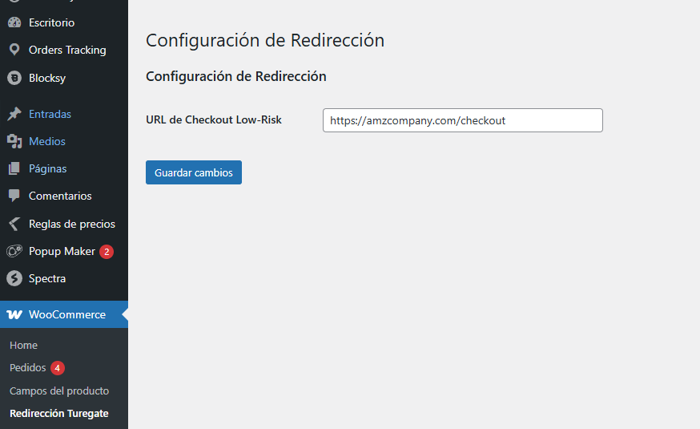
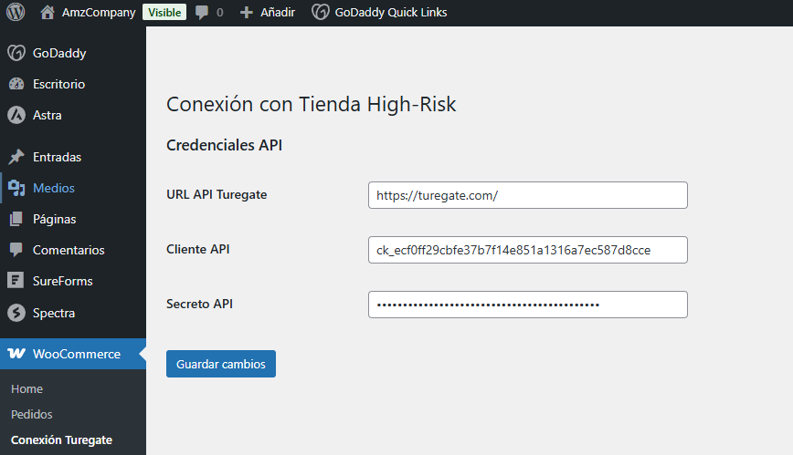

# Sistema de Redirección de Pagos WooCommerce

**Plugins para Tiendas High-Risk (turegate.com) y Low-Risk (amzcompany.com)**

---

## 📌 Descripción General

Este sistema permite conectar dos tiendas WooCommerce para:
- Redirigir pagos desde tienda high-risk (sin pasarela de pago) → low-risk (con pasarela)
- Mantener sincronización completa de órdenes
- Preservar todos los datos del cliente y personalizaciones de productos
- Actualizar automáticamente estados de pedidos

---

## 🛠 Instalación

### Requisitos Previos
- WooCommerce 6.0+ en ambas tiendas
- PHP 7.4+ 
- Acceso API REST en turegate.com

### Pasos de Instalación

1. **Tienda High-Risk (turegate.com)**
   - Subir archivo `turegate-payment-redirect.php` a `/wp-content/plugins/`
   - Activar plugin desde el admin de WordPress

2. **Tienda Low-Risk (amzcompany.com)**
   - Subir archivo `amzcompany-payment-gateway.php` a `/wp-content/plugins/`
   - Activar plugin desde el admin de WordPress

---

## ⚙ Configuración

### 🔗 En turegate.com (High-Risk)
1. Ir a **WooCommerce → Redirección Turegate**
2. Configurar:
   - **URL de Checkout Low-Risk**: `https://amzcompany.com/checkout/`

 

### 🔐 En amzcompany.com (Low-Risk)
1. Ir a **WooCommerce → Conexión Turegate**
2. Configurar:
   - **URL API Turegate**: `https://turegate.com/wp-json/wc/v3/`
   - **Cliente API**: [Obtener de WooCommerce → Ajustes → API]
   - **Secreto API**: [Obtener de WooCommerce → Ajustes → API]



---

## 🚀 Funcionalidades Clave

### 🔄 Flujo de Trabajo Integrado
```mermaid
graph TD
    A[Cliente en turegate.com] --> B{Añade productos<br>con personalizaciones}
    B --> C[Creación de orden local]
    C --> D[Redirección a amzcompany.com]
    D --> E[Pago exitoso]
    E --> F[Sincronización automática]
    F --> G[Actualización estado en turegate.com]

